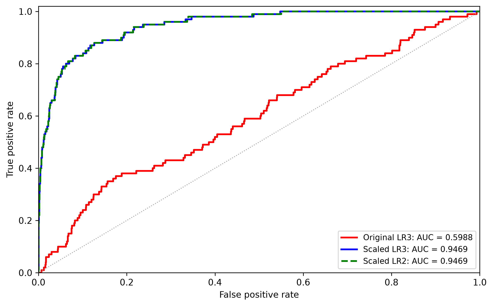

# Bonus Project 1: Investigating Logistic Regression Performance on the Default Dataset

This project investigates an unexpected drop in the ROC-AUC of logistic regression on the **Default** dataset. In the initial experiment, a logistic regression model using `balance`, `income`, and `student` performs substantially worse than a model that excludes `income`, while linear discriminant analysis (LDA) performs well with all three predictors.

The notebook reproduces this behavior and examines whether the low AUC is necessarily caused by including `income`, or whether model-fitting settings—particularly feature scaling, solver choice, and optimization tolerance—also matter. It then compares the two- and three-feature models using repeated cross-validation and a held-out test set.

## Project Structure

```text
Bonus-Project 1/
├── README.md
├── requirements.txt
├── data/
│   └── Default.csv
├── notebook/
│   └── Bonus_Project_1.ipynb
└── result/
    ├── fig_0.png
    ├── fig_1.png
    ├── fig_2.png
    ├── fig_3.png
    └── fig_4.png
```

| Path | Description |
| --- | --- |
| `data/Default.csv` | Input dataset, included in the repository. |
| `notebook/Bonus_Project_1.ipynb` | Main notebook containing data preparation, experiments, evaluation, and visualizations. |
| `result/` | Figures produced by the notebook. Running the plotting cells updates these files. |
| `requirements.txt` | Pinned versions of the project's four main Python packages. |

## Dataset

The project uses the **Default** dataset, which contains **10,000 observations**. The original CSV has five columns:

| Column | Description |
| --- | --- |
| `rownames` | Row identifier; not used as a predictor. |
| `default` | Binary response (`Yes`/`No`), indicating whether a customer defaults. |
| `student` | Student indicator (`Yes`/`No`). |
| `balance` | Credit card balance. |
| `income` | Customer income. |

In the notebook, `default` and `student` are converted to binary indicators (`Yes = 1`, `No = 0`). The dataset has a default rate of **3.33%**.

Two predictor sets are compared:

- **Three features:** `balance`, `income`, `student`
- **Two features:** `balance`, `student`

No additional data download is necessary because `Default.csv` is included.

## Requirements

The notebook metadata records **Python 3.14.7** as the development environment. Using that version is recommended for the closest reproduction; the notebook also uses f-string syntax that requires **Python 3.12 or newer**.

The repository includes the following pinned package versions in `requirements.txt`:

| Package | Version | Purpose |
| --- | --- | --- |
| NumPy | 2.5.2 | Numerical operations and array handling |
| Pandas | 3.0.5 | Data loading, manipulation, and result tables |
| Matplotlib | 3.11.1 | Plots and ROC curves |
| Scikit-learn | 1.9.0 | Models, preprocessing, validation, and metrics |

**JupyterLab** (or another Jupyter-compatible notebook environment) is also needed to open and run the notebook; it is not listed in the project's `requirements.txt`.

## Installation and Usage

**1. Open a terminal in the project directory** (the directory containing `requirements.txt`, `data/`, and `notebook/`).

**2. Create and activate a virtual environment** (macOS/Linux):

```bash
python3.14 -m venv .venv
source .venv/bin/activate
```

If Python 3.14 is your default interpreter, `python -m venv .venv` works as well. On Windows, activate the environment with `.venv\Scripts\activate` instead.

**3. Install the dependencies:**

```bash
python -m pip install -r requirements.txt
python -m pip install jupyterlab ipykernel
```

**4. Launch the notebook from the `notebook/` directory:**

```bash
cd notebook
jupyter lab Bonus_Project_1.ipynb
```

Select the environment's Python kernel and run the notebook cells **in order, from top to bottom**.

> **Important:** The notebook uses relative paths: `../data/Default.csv` for the input and `../result/` for generated figures. Its working directory must therefore be `notebook/`. Keep the `data/` and `result/` directories in their existing locations.

## Experimental Workflow

The notebook follows four main stages:

1. **Load and explore the data.** Read `Default.csv`, encode binary variables, and examine the distributions of `balance` and `income` by default status.
2. **Reproduce the original AUC discrepancy.** Fit three-feature logistic regression, two-feature logistic regression, and three-feature LDA; compare their training ROC-AUC and log loss.
3. **Diagnose the logistic regression fit.** Compare the original `liblinear` configuration against more iterations, a tighter optimization tolerance, standardized predictors, and the `lbfgs` solver.
4. **Evaluate generalization.** Use a stratified **70%/30% train/test split**, run **5-fold stratified cross-validation repeated 4 times** on the training set, and compare selected models on the held-out test set.


## Main Results

### Reproducing the discrepancy

The initial models are fitted and evaluated on the **full dataset**. These are *training metrics*, not estimates of out-of-sample performance.

| Model | Training ROC-AUC | Training Log Loss |
| --- | ---: | ---: |
| Logistic Regression — 3 features | 0.5951 | 0.1735 |
| Logistic Regression — 2 features | 0.9496 | 0.0792 |
| LDA — 3 features | 0.9495 | 0.0797 |

### Diagnosing model fitting

For logistic regression with all three features, the notebook reports:

| Configuration | Training ROC-AUC | Training Log Loss |
| --- | ---: | ---: |
| Original (`liblinear`) | 0.595079 | 0.173455 |
| More iterations | 0.595079 | 0.173455 |
| Stricter tolerance | 0.948905 | 0.079346 |
| `StandardScaler` + `liblinear` | 0.949564 | 0.078667 |
| `lbfgs` solver | 0.949571 | 0.078578 |

Simply increasing the iteration limit does not improve the original fit. By contrast, stricter convergence tolerance, scaling, and a different solver are each associated with substantially higher AUC in the tested configurations. These comparisons **do not isolate a single causal mechanism**: scaling changes the effective role of regularization, and solvers can differ in implementation details.

### Cross-validation and test-set performance

The repeated cross-validation compares standardized two- and three-feature logistic regression models with `lbfgs`:

| Model | Mean validation ROC-AUC | SD across folds |
| --- | ---: | ---: |
| Scaled Logistic Regression — 3 features | 0.950319 | 0.009599 |
| Scaled Logistic Regression — 2 features | 0.950570 | 0.009555 |

The mean paired AUC difference (**3 features − 2 features**) across the 20 validation folds is **−0.000251**.

The held-out test results are:

| Model | Test ROC-AUC | Test Log Loss |
| --- | ---: | ---: |
| Original Logistic Regression — 3 features | 0.598807 | 0.173298 |
| Scaled Logistic Regression — 3 features | 0.946883 | 0.077900 |
| Scaled Logistic Regression — 2 features | 0.946945 | 0.077824 |

**Takeaway:** The severe AUC drop is not an unavoidable consequence of including `income`: a properly configured three-feature logistic regression attains performance comparable to the two-feature model. In this experiment, however, adding `income` does not provide a meaningful improvement in predictive discrimination.

## Figures

The notebook creates the following figures in `result/`:

| File | Content |
| --- | --- |
| [`fig_0.png`](result/fig_0.png) | Distributions of `balance` and `income` by default status |
| [`fig_1.png`](result/fig_1.png) | Training ROC curves for the initial logistic regression and LDA models |
| [`fig_2.png`](result/fig_2.png) | Training AUC and log-loss comparisons across fitting configurations |
| [`fig_3.png`](result/fig_3.png) | Fold-wise paired AUC differences in repeated cross-validation |
| [`fig_4.png`](result/fig_4.png) | ROC curves for the held-out test-set comparison |



## Reproducibility Notes

- The experiment is implemented in a **single Jupyter notebook**, rather than separate Python scripts.
- The initial reproduction and solver diagnostic comparisons use **in-sample metrics**; the subsequent cross-validation and held-out test experiments assess generalization.
- Feature standardization in the validation experiments is implemented inside Scikit-learn pipelines, so the scaler is fitted separately within each training fold.
- The train/test split is stratified, with 7,000 training observations and 3,000 test observations.
- Displayed values are taken from the saved notebook outputs. Exact results may depend on the Python and library versions used.
